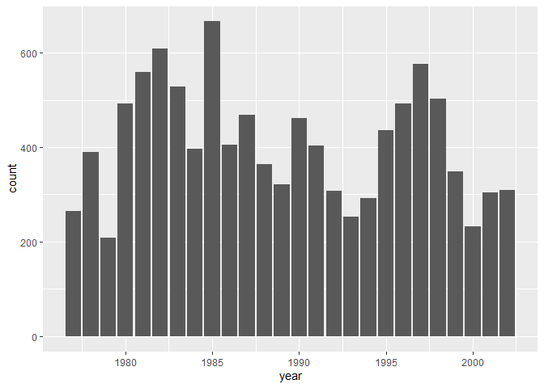

## Instructions
Answer the following questions and complete the exercises in RMarkdown. Please embed all of your code and push your final work to your repository. Your final lab report should be organized, clean, and run free from errors. Remember, you must remove the `#` for the included code chunks to run. Be sure to add your name to the author header above. For any included plots, make sure they are clearly labeled. You are free to use any plot type that you feel best communicates the results of your analysis.  

Make sure to use the formatting conventions of RMarkdown to make your report neat and clean!  

## Load the libraries

```r
library(tidyverse)
library(janitor)
library(here)
library(naniar)
```

## Desert Ecology
For this assignment, we are going to use a modified data set on [desert ecology](http://esapubs.org/archive/ecol/E090/118/). The data are from: S. K. Morgan Ernest, Thomas J. Valone, and James H. Brown. 2009. Long-term monitoring and experimental manipulation of a Chihuahuan Desert ecosystem near Portal, Arizona, USA. Ecology 90:1708.

```r
deserts <- read_csv(here("lab10", "data", "surveys_complete.csv"))
```

```
## Rows: 34786 Columns: 13
## ── Column specification ────────────────────────────────────────────────────────
## Delimiter: ","
## chr (6): species_id, sex, genus, species, taxa, plot_type
## dbl (7): record_id, month, day, year, plot_id, hindfoot_length, weight
## 
## ℹ Use `spec()` to retrieve the full column specification for this data.
## ℹ Specify the column types or set `show_col_types = FALSE` to quiet this message.
```

1. Use the function(s) of your choice to get an idea of its structure, including how NA's are treated. Are the data tidy?  *The data appear tidy. NAs are left blank.*

```r
head(deserts)
```

```
## # A tibble: 6 × 13
##   record_id month   day  year plot_id speci…¹ sex   hindf…² weight genus species
##       <dbl> <dbl> <dbl> <dbl>   <dbl> <chr>   <chr>   <dbl>  <dbl> <chr> <chr>  
## 1         1     7    16  1977       2 NL      M          32     NA Neot… albigu…
## 2         2     7    16  1977       3 NL      M          33     NA Neot… albigu…
## 3         3     7    16  1977       2 DM      F          37     NA Dipo… merria…
## 4         4     7    16  1977       7 DM      M          36     NA Dipo… merria…
## 5         5     7    16  1977       3 DM      M          35     NA Dipo… merria…
## 6         6     7    16  1977       1 PF      M          14     NA Pero… flavus 
## # … with 2 more variables: taxa <chr>, plot_type <chr>, and abbreviated
## #   variable names ¹​species_id, ²​hindfoot_length
```

```r
naniar::miss_var_summary(deserts)
```

```
## # A tibble: 13 × 3
##    variable        n_miss pct_miss
##    <chr>            <int>    <dbl>
##  1 hindfoot_length   3348     9.62
##  2 weight            2503     7.20
##  3 sex               1748     5.03
##  4 record_id            0     0   
##  5 month                0     0   
##  6 day                  0     0   
##  7 year                 0     0   
##  8 plot_id              0     0   
##  9 species_id           0     0   
## 10 genus                0     0   
## 11 species              0     0   
## 12 taxa                 0     0   
## 13 plot_type            0     0
```


2. How many genera and species are represented in the data? What are the total number of observations? Which species is most/ least frequently sampled in the study?

```r
deserts %>% 
   summarize(across(c(record_id, genus, species), n_distinct))
```

```
## # A tibble: 1 × 3
##   record_id genus species
##       <int> <int>   <int>
## 1     34786    26      40
```

```r
deserts %>% 
  count(species, sort = TRUE) %>% 
  slice(c(which.max(n), which.min(n)))
```

```
## # A tibble: 2 × 2
##   species      n
##   <chr>    <int>
## 1 merriami 10596
## 2 clarki       1
```


3. What is the proportion of taxa included in this study? Show a table and plot that reflects this count.

```r
deserts_taxa <- deserts %>% 
  count(taxa, sort = TRUE) %>% 
  mutate(prop = `n` / sum(`n`))
deserts_taxa
```

```
## # A tibble: 4 × 3
##   taxa        n     prop
##   <chr>   <int>    <dbl>
## 1 Rodent  34247 0.985   
## 2 Bird      450 0.0129  
## 3 Rabbit     75 0.00216 
## 4 Reptile    14 0.000402
```


```r
deserts_taxa %>% 
  ggplot(aes(x="", y = prop, fill = taxa))+
  geom_col()+
  geom_label(aes(label = taxa),
            position = position_stack(vjust = 0.5), 
            show.legend = FALSE) +
  coord_polar(theta = "y") +
  labs(title = "Proportions of Taxa",
       fill= "Taxon")+
  coord_flip()
```

```
## Coordinate system already present. Adding new coordinate system, which will
## replace the existing one.
```

<!-- -->
  
  4. For the taxa included in the study, use the fill option to show the proportion of individuals sampled by `plot_type.`


```r
deserts %>% 
  ggplot(aes(x = taxa, fill = plot_type))+
  geom_bar(position = position_fill())+ 
  scale_y_continuous(labels = scales::percent)+
  coord_flip()
```

<!-- -->

5. What is the range of weight for each species included in the study? Remove any observations of weight that are NA so they do not show up in the plot.

```r
p <- deserts %>% 
  ggplot(aes(x=species, y=weight))+
  geom_boxplot(na.rm = TRUE)+
  coord_flip()+
  scale_y_log10()
p
```

<!-- -->

6. Add another layer to your answer from #4 using `geom_point` to get an idea of how many measurements were taken for each species.

```r
p + geom_point(position = position_dodge(width = 0.25))
```

```
## Warning: Removed 2503 rows containing missing values (`geom_point()`).
```

<!-- -->

7. [Dipodomys merriami](https://en.wikipedia.org/wiki/Merriam's_kangaroo_rat) is the most frequently sampled animal in the study. How have the number of observations of this species changed over the years included in the study?

```r
deserts %>% 
  filter(species == "merriami") %>% 
  ggplot(aes(x=year))+
  geom_bar()
```

<!-- -->

8. What is the relationship between `weight` and `hindfoot` length? Consider whether or not over plotting is an issue. *There is a roughly positive log-linear relationship between hindfoot length and weight, but are so many points, that it becomes difficult to see the individual data points.*


```r
deserts %>% 
  ggplot(aes(x=hindfoot_length, y=log10(weight)))+
  geom_point(na.rm = TRUE)+
  geom_smooth(method=lm, se=F)
```

```
## `geom_smooth()` using formula = 'y ~ x'
```

```
## Warning: Removed 4048 rows containing non-finite values (`stat_smooth()`).
```

<!-- -->

9. Which two species have, on average, the highest weight? *albigula and spectabilis* Once you have identified them, make a new column that is a ratio of `weight` to `hindfoot_length`. Make a plot that shows the range of this new ratio and fill by sex.

```r
highest_weight <- deserts %>% 
  group_by(species) %>% 
  summarise(mean_weight=mean(weight, na.rm = TRUE)) %>% 
  arrange(-mean_weight) %>% 
  slice_head(n=2)
highest_weight
```

```
## # A tibble: 2 × 2
##   species     mean_weight
##   <chr>             <dbl>
## 1 albigula           159.
## 2 spectabilis        120.
```


```r
deserts %>% 
  filter(species == c("albigula","spectabilis")) %>% 
  mutate(weight_to_foot = weight/hindfoot_length) %>% 
  ggplot(aes(x=species, y=weight_to_foot, fill=sex))+
  geom_boxplot()
```

```
## Warning: Removed 330 rows containing non-finite values (`stat_boxplot()`).
```

<!-- -->

10. Make one plot of your choice! Make sure to include at least two of the aesthetics options you have learned.

```r
deserts %>% 
  ggplot(aes(x = plot_type, fill = genus))+
  geom_bar(position = position_fill())+ 
  scale_y_continuous(labels = scales::percent)+
  theme(axis.text.x = element_text(angle = 60, hjust = 1)) +
  labs(title = "Percent Genus per Plot Type",
       x = "Plot Type", y= "Percentage",
       fill= "Genus")
```

<!-- -->

## Push your final code to GitHub!
Please be sure that you check the `keep md` file in the knit preferences. 
